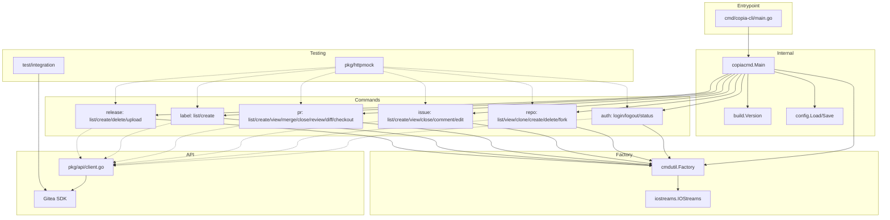
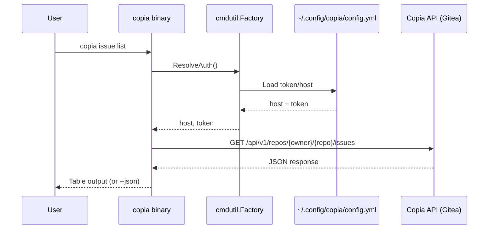

# Codebase Map

> Auto-generated by Cartographer. Last mapped: 2026-04-01T17:19:06Z

## System Overview



## Directory Structure

```
copia-cli/
├── cmd/copia-cli/main.go              # Entrypoint → copiacmd.Main()
├── internal/
│   ├── build/build.go             # Version/Date injection (ldflags)
│   ├── config/config.go           # YAML config (~/.config/copia/config.yml)
│   └── copiacmd/root.go           # Root command wiring, Main()
├── pkg/
│   ├── api/client.go              # Gitea SDK wrapper
│   ├── cmd/
│   │   ├── auth/                  # login, logout, status
│   │   ├── repo/                  # list, view, clone, create, delete, fork
│   │   ├── issue/                 # list, create, view, close, comment, edit
│   │   ├── pr/                    # list, create, view, merge, close, review, diff, checkout
│   │   ├── label/                 # list, create
│   │   └── release/               # list, create, delete, upload
│   ├── cmdutil/
│   │   ├── factory.go             # Factory dependency injection
│   │   └── json.go                # --json flag + PrintJSON
│   ├── iostreams/iostreams.go     # TTY-aware I/O, Test() helper
│   └── httpmock/registry.go       # HTTP transport mock for testing
├── test/integration/              # Live API integration tests
├── .github/workflows/             # CI, CodeQL, release, govulncheck, bump-go
├── .devcontainer/                 # Go 1.26.1, gh CLI, Claude Code
├── .goreleaser.yml                # Cross-platform release config
└── Makefile                       # build, test, integration, clean
```

## Module Guide

### `cmd/copia-cli/`
**Purpose:** Binary entrypoint — delegates to `copiacmd.Main()`
**Entry point:** `main.go`

### `internal/build/`
**Purpose:** Version and date injection via ldflags at build time
**Entry point:** `build.go`
**Exports:** `var Version`, `var Date`
**Pattern:** `init()` falls back to `debug.ReadBuildInfo()` when `Version == "DEV"`

### `internal/config/`
**Purpose:** YAML config management for multi-host credentials
**Entry point:** `config.go`
**Exports:** `Config`, `HostConfig`, `Load()`, `Save()`, `DefaultPath()`, `DefaultHost()`
**Pattern:** XDG Base Dir, 0600 permissions, graceful empty-config on missing file

### `internal/copiacmd/`
**Purpose:** Root command construction and `Main()` entrypoint
**Entry point:** `root.go`
**Exports:** `NewRootCmd(f)`, `Main() int`
**Pattern:** Constructs Factory, reads env vars, registers all command groups

### `pkg/api/`
**Purpose:** Thin factory for Gitea SDK clients
**Exports:** `NewClient()`, `NewClientWithHTTP()`
**Pattern:** `NewClientWithHTTP` accepts custom transport for httpmock testing

### `pkg/cmdutil/`
**Purpose:** Shared dependency container and CLI helpers
**Key files:**
| File | Purpose |
|------|---------|
| `factory.go` | Factory struct with `ResolveAuth()` |
| `json.go` | `JSONFlags`, `AddJSONFlags()`, `PrintJSON()` |

### `pkg/iostreams/`
**Purpose:** TTY-aware I/O abstraction
**Exports:** `IOStreams`, `System()`, `Test()`
**Pattern:** `Test()` returns `(*IOStreams, stdin, stdout, stderr)` — used in every unit test

### `pkg/httpmock/`
**Purpose:** HTTP transport mock for unit testing
**Exports:** `Registry`, `REST()`, `StringResponse()`, `Verify()`
**Pattern:** Implements `http.RoundTripper`; `Verify(t)` asserts all stubs called

### `pkg/cmd/` (Command Packages)

Every command follows identical structure:

```go
type XxxOptions struct { IO, HTTPClient, Host, Token, Owner, Repo, ... }
func NewCmdXxx(f *cmdutil.Factory) *cobra.Command { ... }
func xxxRun(opts *XxxOptions) error { ... }  // unexported, testable
```

| Group | Subcommands | API Pattern |
|-------|-------------|-------------|
| `auth` | login, logout, status | Raw HTTP (no SDK) |
| `repo` | list, view, clone, create, delete, fork | Raw HTTP + git exec |
| `issue` | list, create, view, close, comment, edit | Raw HTTP |
| `pr` | list, create, view, merge, close, review, diff, checkout | Raw HTTP + git exec |
| `label` | list, create | Raw HTTP |
| `release` | list, create, delete, upload | Raw HTTP + multipart |

### `test/integration/`
**Purpose:** Live API tests against Copia instance
**Pattern:** `//go:build integration`, env vars for credentials, defer cleanup
**Files:** auth, repo, issue, label, PR tests + shared `helpers_test.go`

## Data Flow



## Conventions

- **Naming:** camelCase for Go, kebab-case for flags, lowercase package names
- **Error handling:** `_, _ = fmt.Fprintf()` for I/O writes, `defer func() { _ = resp.Body.Close() }()` for response bodies
- **Output:** `text/tabwriter` for tables, `cmdutil.PrintJSON` for `--json` mode
- **Testing:** TDD — test written before implementation, httpmock + iostreams.Test()
- **Git workflow:** Gitflow, conventional commits, issue-driven branches, PR-only merges

## Gotchas

- **Auth commands use raw HTTP** — not the Gitea SDK, because `NewClient` tries to connect on init
- **`f.BaseRepo` can be nil** — commands that don't need repo context (auth, repo create) must check before calling
- **Gitea returns 403 (not 401) for invalid tokens** — integration tests use `Contains([]int{401, 403})`
- **`splitOwnerRepo` duplicated** — exists in `repo/view`, `repo/delete`, `repo/fork` independently
- **PR checkout doesn't use auth** — pure git shell-out, relies on git credential config

## Navigation Guide

**To add a new command group (e.g., `copia org`):**
1. Create `pkg/cmd/org/org.go` (aggregator)
2. Create subcommand dirs: `pkg/cmd/org/list/`, `pkg/cmd/org/view/`
3. Follow Options + NewCmd + Run pattern
4. Register in `internal/copiacmd/root.go`: `cmd.AddCommand(orgCmd.NewCmdOrg(f))`

**To add a subcommand to existing group:**
1. Create dir: `pkg/cmd/issue/reopen/`
2. Create `reopen.go` + `reopen_test.go`
3. Register in `pkg/cmd/issue/issue.go`

**To add a new flag to a command:**
1. Add field to `XxxOptions` struct
2. Bind in `NewCmdXxx`: `cmd.Flags().StringVar(&opts.Field, ...)`
3. Use in `xxxRun(opts)`

**To add integration tests:**
1. Add to `test/integration/` with `//go:build integration` tag
2. Use `loadTestEnv(t)` for credentials
3. Cleanup with `defer`
